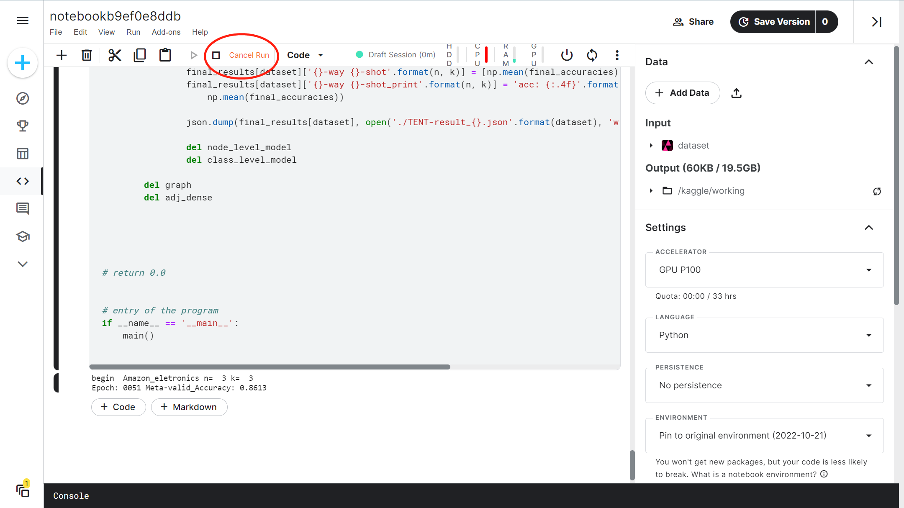

# CSIT 5210 Group1 Project
### Student Name: LI Yu, LIU Boyang, CAI Zichun, LONG Shiyao, FU Peng, JIANG Yunpeng

### how to compile and execute
To run our code, please copy the code in `kaggle.ipynb` into a platform with jupyter nodebook, such as kaggle.
Then run it directly.

### description of each file
`data.py`- Implementation of data preprocess

`model.py` - Implementation of models

`utils.py` - Implementation of tool functions

`main.py` - Implementation of training and testing process 

`main_1.py` - Optimized training and testing process

`ema.py` - Our attempt to improve the performance of framework

`kaggle.ipynb` - Final code in a format which can be used in jupyter notebook

`/dataset` - The four datasets

`/visualization` - Implementation of evaluation and visualization

`/debug` - The output of debugging

### operating system of our program
linux

### An example to show how to run the program

